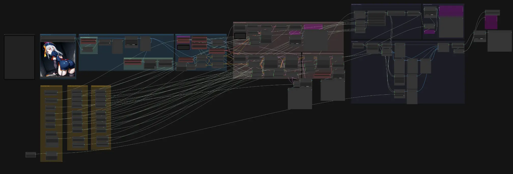
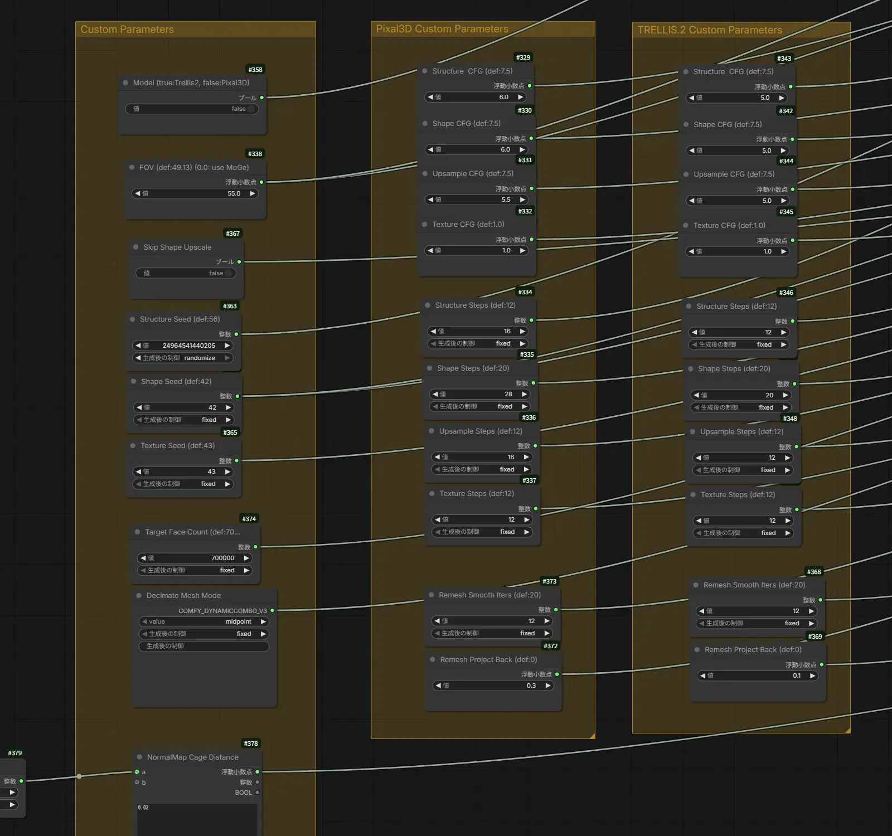

# Native Pixal3D & TRELLIS.2 Tuning Workflow for ComfyUI

[日本語](README.ja.md)

An experimental tuning and comparison workflow derived from ComfyUI's official **Pixal3D & TRELLIS.2: Image to Model** template.

It keeps the native ComfyUI 3D pipeline while exposing model-specific controls for CFG, sampling steps, seeds, camera FOV, shape upscaling, remeshing, texture baking, previews, and GLB export.

> This is not a new model, a custom inference implementation, or a claim of universally optimal settings. It is a parameter-surfaced variant of the official workflow, intended as a practical starting point for comparison and experimentation.



<details>
<summary>Detailed tuning controls</summary>



</details>

## Why this workflow exists

The official template is a complete end-to-end reference workflow, but many tuning values are distributed across the graph. This variant collects the values that are useful during iteration into three control areas:

- **Pixal3D Custom Parameters**
- **TRELLIS.2 Custom Parameters**
- **Shared Custom Parameters**

This makes it possible to keep different presets for the two models and switch between them without rebuilding the graph.

## Verified differences from the official template

The comparison below was made directly against the supplied official `3d_pixal3d_trellis2_image_to_model` JSON, not inferred from a screenshot.

| Graph | Nodes | Groups | Links |
| --- | ---: | ---: | ---: |
| Official template | 66 | 12 | 100 |
| This workflow | 121 | 15 | 169 |

This variant adds or changes:

- Three dedicated control groups: shared, Pixal3D, and TRELLIS.2
- Per-model routing for Structure, Shape, Upsample, and Texture CFG/steps
- Centralized Structure, Shape, and Texture seed controls
- Manual FOV override, with `0.0` retaining the official MoGe-estimated path
- Shape Upscale bypass routed to both Texture Stage and shape decoding
- Per-model Remesh Smooth Iterations and Project Back values
- Central controls for target face count and decimation placement mode
- Externalized Normal Map Cage Distance at exact value `0.02`
- Five additional `Render Mesh → Preview Image` checkpoints: sparse mesh, decoded shape, painted decoded shape, post-processed mesh, and vertex-color mesh
- A standard `Save GLB` output in addition to the official Advanced 3D save path

The following are inherited from the official template and are **not claimed as modifications**:

- The native Pixal3D/TRELLIS.2 generation pipeline and original model-selection logic
- Background removal, cropping, DINOv3 conditioning, and MoGe FOV estimation
- Structure, Shape, Upsample, Texture, Remesh, Decimate, UV unwrap, and PBR baking stages
- 4096 texture resolution
- Base Color, Roughness, Metallic, Normal, and Ambient Occlusion baking/previews
- The vertex-color branch and Advanced 3D preview/save nodes

No third-party generation node pack is required.

## Files

- `workflows/native_pixal3d_trellis2_tuning.json` — the workflow
- `examples/input-reference.jpg` — the reference image used during testing
- `docs/images/workflow-overview.webp` — full graph overview
- `docs/images/tuning-controls.webp` — detailed control-panel crop
- `CIVITAI.md` — ready-to-edit Civitai listing copy and publishing checklist
- `CHANGELOG.md` — repository changes

## Compatibility

Confirmed test environment supplied by the workflow author:

| Component | Version / hardware |
| --- | --- |
| ComfyUI | 0.34.0 |
| ComfyUI Frontend | 1.51.10 |
| Workflow Templates | 0.11.55 |
| OS | Linux |
| GPU | NVIDIA GeForce RTX 5070 Ti, 16 GB VRAM |
| Python | 3.13.14 |
| PyTorch | 2.14.0.dev20260723+cu132 |

The JSON contains frontend metadata from `1.49.6`; it was subsequently run with frontend `1.51.10`. Compatibility outside the environment above is not yet confirmed.

The workflow targets the native Pixal3D/TRELLIS.2 integration added to ComfyUI in August 2026. Update ComfyUI and the frontend before reporting missing-node errors.

## Required model files

The graph references these model filenames:

```text
trellis_2_int8_convrot.safetensors
pixal3d_int8_convrot.safetensors
trellis_2_shape_vae_bf16.safetensors
trellis_2_texture_vae_bf16.safetensors
dino_v3_L_naf_fp32.safetensors
moge_2_vitl_normal_fp16.safetensors
birefnet.safetensors
```

Use the official ComfyUI template/model download instructions for their current download URLs and directories:

- Official workflow: https://comfy.org/workflows/920c795f693a-920c795f693a/
- Official tutorial: https://docs.comfy.org/tutorials/3d/trellis2

## Quick start

1. Update ComfyUI and ComfyUI Frontend.
2. Download the models required by the official Pixal3D/TRELLIS.2 template.
3. Drag `workflows/native_pixal3d_trellis2_tuning.json` into ComfyUI.
4. Select an input image in `Load Image`.
5. Set **Model** to `false` for Pixal3D or `true` for TRELLIS.2.
6. Adjust the model-specific controls only if needed.
7. Queue the workflow and inspect the render/map previews.
8. Find the GLB under `ComfyUI/output/3d/ComfyUI`.

## Included starting presets

These are experimental starting values, not quality rankings or universal recommendations.

| Stage | Pixal3D CFG | Pixal3D Steps | TRELLIS.2 CFG | TRELLIS.2 Steps |
| --- | ---: | ---: | ---: | ---: |
| Structure | 6.0 | 16 | 5.0 | 12 |
| Shape | 6.0 | 28 | 5.0 | 20 |
| Upsample | 5.5 | 16 | 5.0 | 12 |
| Texture | 1.0 | 12 | 1.0 | 12 |

Shared defaults in this release:

| Control | Value |
| --- | ---: |
| Manual FOV | 55 (`0.0` = use MoGe) |
| Skip Shape Upscale | false |
| Target Face Count | 700,000 |
| Texture Resolution | 4096 |
| Pixal3D Remesh Project Back | 0.3 |
| TRELLIS.2 Remesh Project Back | 0.1 |
| Remesh Smooth Iterations | 12 |
| Normal Map Cage Distance | 0.02 |

## Implementation notes

### 4K texture resolution

`4096` is intentionally retained because it is the official template default. It is not presented as a low-VRAM preset. Lowering it may reduce the texture-baking memory requirement, but no VRAM benchmark is included yet.

### Normal Map Cage Distance

The Cage Distance is intentionally supplied through a Math Expression node. The current Primitive Float widget rounds this value to one decimal place, while the workflow needs to preserve `0.02`.

### FOV control

- Any non-zero value uses the manual FOV.
- `0.0` selects the FOV estimated by MoGe.

Pixal3D is pixel-aligned and can be particularly sensitive to camera assumptions. The default `55` is an experimental value used by the author, not an official recommendation.

### Shape Upscale bypass

The bypass switch reroutes both the texture-stage shape input and the decoded mesh path. This is intended for faster comparison or diagnosing whether the upscale stage is contributing unwanted geometry.

## Known limitations

- Peak VRAM and runtime have not been systematically benchmarked.
- The included presets were tuned from limited examples and may not generalize to every subject or camera angle.
- Generated meshes may still contain holes, internal shells, non-manifold areas, or topology unsuitable for deformation and 3D printing.
- The native 3D preview/save nodes and their serialized viewport state can change with frontend updates.
- The workflow loads both model branches in one graph. Actual memory behavior depends on ComfyUI model unloading and launch arguments.
- The bundled reference image is suggestive anime artwork. Apply the appropriate mature-content label when reposting it, and replace it if the destination requires a general-audience cover.

## Troubleshooting

### A 3D Preview node reports a missing `viewport_state`

Update both ComfyUI and ComfyUI Frontend. If an older serialized Advanced Preview node remains incompatible, remove and recreate that node in the current frontend, or use the standard render previews and `Save GLB` path included in this workflow.

### Missing nodes

This workflow depends on recent native ComfyUI 3D nodes. A root repository update alone may not update every installation layout. Confirm the displayed ComfyUI and frontend versions after restart.

### Out of memory during texture baking

The workflow intentionally keeps the official 4096 texture default. Try 2048 for a diagnostic run. This changes output resolution and should not be described as equivalent quality.

## Credits and license

Based on the official ComfyUI workflow template:

- https://github.com/Comfy-Org/workflow_templates
- https://comfy.org/workflows/920c795f693a-920c795f693a/

The upstream workflow template repository is MIT licensed. This repository preserves attribution and documents the modifications. Model weights and upstream projects retain their own licenses; review them separately before commercial use or redistribution.

Workflow modifications and documentation are released under the [MIT License](LICENSE).
